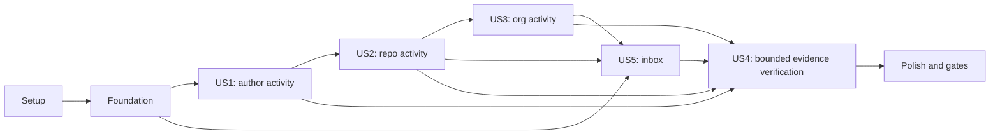

# Tasks: PR Activity and Personal Inbox

**Input**: Design artifacts in `specs/003-pull-request-query/`.
**Branch**: `feature/127-pull-request-query`.
**Prerequisites**: [plan.md](plan.md), [spec.md](spec.md), [research.md](research.md),
[data-model.md](data-model.md), [contracts](contracts/), and [quickstart.md](quickstart.md).
The plan's pre/post-design Constitution Checks both pass all ten gates.

**Tests**: Required for every new behavior, with regression fixtures for edge cases. Write
story tests before implementation and observe the intended failure; compile failures from
not-yet-added public types are acceptable initial failures, not passing tests. Use `httptest`,
isolate HOME/USERPROFILE and credential/config environment, and prohibit live provider calls.
Budget enforcement, read-only access, and partial evidence apply from the first working story.

**Organization**: Setup → foundation → US1, US2, US3, US5 (P1) → US4 (P2) → polish.
Story labels retain the specification's numbering. US4 verifies the shared guarantees across
all completed workflows; it does not postpone those guarantees until a later increment.

## Format and Path Conventions

Every task is `- [ ] TNNN [P?] [USn?] Description with repository-relative file paths`.
`[P]` means a task can run alongside the other identified tasks in its phase after its phase
prerequisites are satisfied. It is not permission to run before dependencies or to edit the
same files concurrently. Paths identify implementation targets, including files to be created.
Unmarked tasks are sequential in listed order. All checkboxes start unchecked.

## Phase 1: Setup (Shared Infrastructure)

**Purpose**: Establish a reproducible offline baseline without new tooling or dependencies.

- [X] T001 Verify the feature branch and ten passing design gates, run `go -C tools tool task test`, and record the baseline outcome and existing failures, if any, in `specs/003-pull-request-query/quickstart.md`; inspect `go.mod` and retain the pinned dependencies.
- [X] T002 Add reusable local provider fixture helpers and a request recorder in `ghclient/pr_test.go` and `ghclient/testdata/pr/`; enforce GET-only allowed endpoints, deterministic pages and fixed clocks, and avoid any real token or provider access.

**Checkpoint**: Existing behavior has a recorded baseline and collector fixtures can inspect
actual dispatched requests, not just mocked helper return values.

## Phase 2: Foundational (Blocking Prerequisites)

**Purpose**: Establish shared public evidence, resolution, normalization, and isolated budgets.
Complete this phase before any story work. Do not register partially implemented workflows.

### Required tests

- [X] T003 [P] Add JSON contract tests in `model/pr_test.go` for the two independent schema versions, query/result shapes, null versus known-empty/zero metadata, occurrence/reason ordering, array/count consistency, and unchanged commit/activity schema constants.
- [X] T004 [P] Add resolver/default tests in `config/pr_test.go` and `config/config_test.go` covering both queries, scope/target intersection and validation, login-only identities, injection rejection, UTC/offset/equal boundaries, explicit since precedence, all-state/action defaults, draft omission/false, zero/negative caps, and unsupported providers/roles.
- [X] T005 [P] Add actual HTTP budget/session tests in `ghclient/pr_session_test.go` for independent counters and construction settings, every dispatched request counted, cancellation/timeouts, rejected over-budget dispatches, no unmetered quota call, and no mutation of existing client behavior.
- [X] T006 [P] Add normalization/completeness tests in `ghclient/pr_normalize_test.go` for missing metadata, invalid identity, unknown merge disposition, confirmed versus unconfirmed matches, targeted sanitized errors/disclosures, duplicate pages, stable output, and cost-category totals.

### Implementation

- [X] T007 Define the shared PR metadata, activity/inbox query and result envelopes, match/relationship types, coverage, disclosures, and cost fields in `model/pr.go` exactly as specified in `specs/003-pull-request-query/data-model.md`; initialize required collections and preserve existing schema constants.
- [X] T008 Implement `ResolvePRs`, `ResolvePRInbox`, applicable validation helpers and `MaxPRs=100` defaults in `config/pr.go` and `config/config.go`; reuse window parsing, reject contradictory state/action combinations, ignore inapplicable configured inbox fields, and add `max_prs` with its env/flag mapping to `config.example.yaml`.
- [X] T009 Implement private fresh PR sessions in `ghclient/pr.go` and retain immutable private construction settings in `ghclient/ghclient.go`; each query's cap must apply without a constructor budget option, with no recursive public dispatch, shared exhausted transport, or reset of commit/activity counters.
- [X] T010 Implement shared PR normalization, stable identity/order, initialized reports, dimensioned coverage, sanitized attributable failures, and identity/discovery/history accounting in `ghclient/pr.go`; reuse `internal/apibudget/budget.go` enforcement without changing existing unmetered behavior or activity quota handling.
- [X] T011 Add applicable-config loader tests in `internal/cli/pr_config_test.go` and shared-startup/legacy-tool validation tests in `internal/mcpserver/server_test.go`; cover precedence, ignored unused inbox windows/commit-provider defaults, config syntax/type errors, invalid shared settings, direct `mcpserver.New` construction, and unchanged standalone command validation. Isolate filesystem and all credential/config environment inputs.
- [X] T012 Add typed PR command config loading in `internal/cli/root.go` with shared small helpers in `internal/cli/prs.go`; add the dedicated MCP loader in `internal/cli/mcp.go` and shared-settings validation in `internal/mcpserver/server.go`. Move legacy `Config.Validate` checks to the existing tool boundaries in `internal/mcpserver/server.go` and `internal/mcpserver/getrepoactivity.go`, before resolution/collection, following `specs/003-pull-request-query/contracts/mcp.md`; preserve standalone loaders/public resolvers and immutable shared defaults, and keep local PR flags from globally overriding commit settings.
- [X] T013 Run `go test ./model ./config ./ghclient ./internal/cli ./internal/mcpserver` and record the foundation checkpoint in `specs/003-pull-request-query/quickstart.md`; verify shared-startup validation and legacy tool guards before new tool registration, and resolve introduced failures without lowering `scripts/check-coverage.sh` thresholds.

**Checkpoint**: Shared evidence and per-call cost controls are tested. Provider discovery and
workflow registrations are still owned by their story phases.

## Phase 3: User Story 1 — A Person's PR Activity (Priority: P1, MVP)

**Goal**: Return an author's opened, merged, and unmerged-closed actions within a window through
`sting prs` and `get_prs`, including closures followed by later reopening.

**Independent Test**: A local author-search dataset returns exactly the qualifying actions,
excludes stale-open-only and unrelated-author PRs, preserves repeated closures and explicit
history gaps, and produces equivalent CLI/MCP evidence without exceeding its request budget.

### Required tests

- [X] T014 [P] [US1] Add lifecycle fixtures/tests in `ghclient/pr_history_test.go` and `ghclient/testdata/pr/history/` for closure then later reopening, repeated distinct closure IDs, merge-associated closure suppression, same-time ambiguity, missing IDs/times, duplicate pages, post-window context, and conflicting record/event merge timestamps.
- [X] T015 [P] [US1] Add search-activity tests in `ghclient/pr_activity_test.go` and `ghclient/testdata/pr/search/` for conservative created-before-until historical candidates, exact local bounds after widened queries, public-only unrestricted search, target chunks/intersections, search caps/incomplete flags, latest-update opt-in, and deferred unknown-state evaluation even for created/updated queries.
- [X] T016 [P] [US1] Add activity rendering tests in `internal/render/pr_test.go` for organization/repository grouping, qualifying action timestamps distinct from current state, explicit window/cost/coverage, empty/partial reports, and no facts absent from JSON.
- [X] T017 [P] [US1] Add activity CLI tests in `internal/cli/prs_test.go` for all documented flags/defaults, draft flag conflicts, provider/role rejection before requests, stdout JSON versus stderr diagnostics, own-cap success, and initialized reports on collection failure.
- [X] T018 [P] [US1] Add activity MCP tests in `internal/mcpserver/getprs_test.go` for typed inputs, omitted versus false/zero values, unknown property rejection, shared resolver behavior, structured partial reports, and sanitized panic recovery that keeps the server alive.

### Implementation

- [X] T019 [US1] Implement fully paginated lifecycle recovery and occurrence classification in `ghclient/pr_history.go`; preserve confirmed cycles, use event IDs only as identity/tie-breaks, defer unresolved merge disposition, invalidate conflicting merge-time matches, and disclose ambiguity without inventing actions.
- [X] T020 [US1] Implement `CollectPRs` search discovery and matching in `ghclient/pr_activity.go`; evaluate known filter mismatches first and defer unknown disposition to history, retain confirmed fetched-page matches before history work, enforce result/request/page bounds, remove invalidated provisional entries, and preserve partial reports on errors.
- [X] T021 [US1] Add PR factory credential/host tests in `internal/commitclient/pr_test.go` verifying existing dedicated PAT/store/anonymous precedence, no ambient token fallback, and private GitHub base URL handling with isolated credentials.
- [X] T022 [US1] Add the GitHub PR factory in `internal/commitclient/pr.go`, reusing the existing credential resolver and client settings; expose only the implemented activity method through its internal interface at this checkpoint, then extend it for inbox in T048 without runtime placeholder methods.
- [X] T023 [US1] Implement `RenderPRs` and `PRsMarkdown` plus shared metadata rendering helpers in `internal/render/pr.go`, preserving structured availability and attributable gaps in human-readable output.
- [X] T024 [US1] Implement and register `sting prs` in `internal/cli/prs.go` and `internal/cli/root.go` with request construction, two-minute context, shared factory/resolver, rendering-before-error, and no positional/enrichment/mutation inputs.
- [X] T025 [US1] Implement and register `get_prs` in `internal/mcpserver/getprs.go` and `internal/mcpserver/server.go`; extend `internal/mcpserver/server_test.go`, `internal/mcpserver/serverjson_test.go`, and `integration/cli_mcp_test.go` registry expectations for the third read-only tool while preserving existing tools.
- [X] T026 [US1] Document the available author-activity workflow, default actions/current-state distinction, historical cost and visibility limits, and unchanged `include_prs` semantics in `README.md`; keep unimplemented scopes/inbox clearly marked as pending within this increment.
- [X] T027 [US1] Run US1 collector, factory, renderer, CLI, MCP, and existing integration tests and record exact commands/results in `specs/003-pull-request-query/quickstart.md`; verify this author-search checkpoint independently without treating the remaining requested scope as complete.

**Checkpoint**: Author activity is a reviewable MVP. No stale PR queue semantics, optional
per-PR enrichment, or undisclosed budget behavior is acceptable in this first increment.

## Phase 4: User Story 2 — Repository PR Activity (Priority: P1)

**Goal**: Query named repositories without an author and apply current-state/draft/action filters.
Depends on the shared activity pipeline and adapters delivered by US1.

**Independent Test**: Two local repositories with different authors/states produce exact filtered
membership and action evidence; closed-unmerged differs from merged, a reopened PR can match
historical closure, and explicit repository failures preserve earlier evidence with an error.

### Required tests

- [X] T028 [P] [US2] Add repository-listing tests in `ghclient/pr_repos_test.go` and `ghclient/testdata/pr/repos/` for all-state pagination, multiple normalized targets, optional author filters, current state/draft combinations, exact boundaries, reopened historical actions, and deterministic traversal.
- [X] T029 [P] [US2] Add explicit-repository failure and unknown-metadata tests in `ghclient/pr_repos_failure_test.go` for inaccessible later targets, missing filter proof, rate-limit distinction, and initialized zero/nonzero-match partial results.
- [X] T030 [P] [US2] Add repository-scope CLI/MCP parity tests in `internal/cli/prs_repos_test.go` and `internal/mcpserver/getprs_repos_test.go` for author omission, target defaults/overrides, merged/closed filters, and no all-time behavior when dates are omitted.

### Implementation

- [X] T031 [US2] Add reusable paginated PR listing and scope-target traversal in `ghclient/pr.go`; use all states for activity and an explicit open-only option reusable by inbox, preserve visibility/availability evidence, and do not add per-PR metadata calls.
- [X] T032 [US2] Wire repository activity into `ghclient/pr_activity.go` using the existing history/matching pipeline and explicit-target error policy; expose the scope through the existing `internal/cli/prs.go` and `internal/mcpserver/getprs.go` adapters without duplicating selection logic.
- [X] T033 [US2] Add repository activity examples and current-state versus action explanations to `README.md`, including merged-only, unmerged-closure, and default-window behavior.
- [X] T034 [US2] Run repository collector and adapter tests plus US1 regressions; record the independent repository checkpoint in `specs/003-pull-request-query/quickstart.md`.

## Phase 5: User Story 3 — Organization Digest and Private Visibility (Priority: P1)

**Goal**: Enumerate accessible organization PR activity, with explicit skipped repositories and
coverage limits. Depends on US2's repository collection.

**Independent Test**: A local org has visible public/private repos and an unreadable repo;
its report preserves available actions and names the skip. Global failures stop instead of
being misclassified as skips, and invisible resources are not invented as known omissions.

### Required tests

- [X] T035 [P] [US3] Add org enumeration/history tests in `ghclient/pr_org_test.go` and `ghclient/testdata/pr/org/` for pagination, normalized order/dedup, optional author/state, incomplete enumeration, and prior evidence retained when one repo's history is unreadable.
- [X] T036 [P] [US3] Add org error/visibility and adapter tests in `ghclient/pr_org_failure_test.go`, `internal/cli/prs_org_test.go`, and `internal/mcpserver/getprs_org_test.go`; distinguish repo access failures from auth/rate-limit/server errors and verify scoped versus public-only search disclosures.

### Implementation

- [X] T037 [US3] Implement reusable org repository enumeration in `ghclient/pr.go` using the budgeted client and existing skip classification; preserve affected scope/repo attribution and deterministic traversal for later inbox reuse.
- [X] T038 [US3] Wire organization dispatch and per-repo continuation into `ghclient/pr_activity.go`, preserving known actions from partially unreadable repositories and stopping on global failures; retain identical CLI/MCP scope semantics.
- [X] T039 [US3] Document organization/private search usage, candidate caps versus result caps, credential-visible coverage, and skip-versus-abort behavior in `README.md`.
- [X] T040 [US3] Run org collector/adapter tests plus earlier story regressions and record the independent organization checkpoint in `specs/003-pull-request-query/quickstart.md`.

## Phase 6: User Story 5 — Personal PR Inbox (Priority: P1)

**Goal**: Expose `sting inbox` / `get_pr_inbox` for the union of currently open authored,
assigned, and directly review-requested PRs, including older drafts, with all confirmed reasons.
Reuse US2/US3 target traversal; no dependency on historical lifecycle classification is required.

**Independent Test**: An offline dataset contains old authored/assigned/direct-review work,
team-only requests, completed work, removed/fulfilled requests, and a PR matching all reasons.
The inbox returns exactly the current personal union, once per PR, unaffected by activity windows.

### Required tests

- [X] T041 [P] [US5] Add identity and repos/org inbox tests in `ghclient/pr_inbox_test.go` and `ghclient/testdata/pr/inbox/` for counted self lookup, explicit user override, all relationship combinations, old drafts, removed/re-requested/fulfilled relationships, completed exclusions, and missing relationship evidence.
- [X] T042 [P] [US5] Add search-inbox tests in `ghclient/pr_inbox_search_test.go` for round-robin relationship pages, team-only exclusion, once-per-repo verification, mixed discovery/visibility, and shared caps. Cover explicit relationship/state/draft contradictions (including before a later page failure), retention of another valid reason, removal after complete-list absence, no removal from interrupted-list absence, unknown fields preserving uncontradicted proof, and later stale stream hits never restoring invalidated matches. Assert exact reasons/counts, attributable disclosures, and incomplete evidence even when reconciliation removes every entry.
- [X] T043 [P] [US5] Add inbox renderer tests in `internal/render/pr_inbox_test.go` for all inclusion reasons, null/empty metadata, no time window, stable grouping, and partial-reason disclosures without invented facts.
- [X] T044 [P] [US5] Add inbox CLI tests in `internal/cli/inbox_test.go` for user/draft/cap flags, inapplicable date/state/role input rejection, ignored configured activity defaults, explicit GitLab rejection, identity errors, and stdout/stderr/exit semantics.
- [X] T045 [P] [US5] Add inbox MCP tests in `internal/mcpserver/getprinbox_test.go` for separate schema, user resolution, omitted versus false/zero, unknown activity-field rejection, isolated calls, and structured partial/failed outputs; verify invalid unused activity defaults do not prevent inbox calls and a rejected activity/legacy call makes zero provider requests and leaves the server usable.

### Implementation

- [X] T046 [US5] Implement `CollectPRInbox`, counted authenticated-user resolution, and repos/org open-PR relationship evaluation in `ghclient/pr_inbox.go`; combine authored/assigned/direct-review reasons, preserve unknowns, and never interpret requested teams alone as a personal reason.
- [X] T047 [US5] Implement inbox search streams and per-repository open-list verification in `ghclient/pr_inbox.go`, reusing `ghclient/pr.go` discovery helpers; preserve visibility restrictions and disclose mixed discovery. Apply the reconciliation rules in `specs/003-pull-request-query/contracts/provider-collection.md`: retain minimal negative/unknown verification facts, remove invalid reasons/entries, distinguish complete-list absence from interrupted verification, prevent later stale search re-admission, and update count/coverage without erasing costs/disclosures or restarting stopped traversal. Avoid per-PR reviewer/detail calls.
- [X] T048 [US5] Extend the internal PR interface/factory tests in `internal/commitclient/pr_test.go` and implementation in `internal/commitclient/pr.go` to cover both completed collector methods while retaining existing credential and host selection.
- [X] T049 [US5] Implement `RenderPRInbox` and `PRInboxMarkdown` in `internal/render/pr_inbox.go` using shared PR metadata helpers and reason/completeness data from the structured result.
- [X] T050 [US5] Implement/register `sting inbox` in `internal/cli/inbox.go` and `internal/cli/root.go`; reuse applicable typed config loading and shared collection adapters while rejecting activity inputs with actionable guidance.
- [X] T051 [US5] Implement/register `get_pr_inbox` in `internal/mcpserver/getprinbox.go` and `internal/mcpserver/server.go`; update registry tests in `internal/mcpserver/server_test.go`, `internal/mcpserver/serverjson_test.go`, and `integration/cli_mcp_test.go` to exactly four read-only tools.
- [X] T052 [US5] Document the inbox, all three reasons, direct-versus-team requests, user resolution, private visibility, and its lack of an age cutoff in `README.md`; describe provider actions as outside sting.
- [X] T053 [US5] Add external-package usage examples for resolving/collecting both PR workflows in `ghclient/pr_example_test.go`, using a local server and explicit users, and assert independent schema constants and existing import compatibility.
- [X] T054 [US5] Run inbox collector/factory/render/CLI/MCP tests, examples, and prior story regressions; record the independent inbox checkpoint in `specs/003-pull-request-query/quickstart.md`.

## Phase 7: User Story 4 — Bounded Evidence Across CLI and Agents (Priority: P2)

**Goal**: Verify the already-required cost, completeness, compatibility, and read-only guarantees
across every completed workflow at real package and executable boundaries.

**Independent Test**: Equivalent CLI/MCP requests against fixed local fixtures return the same
normalized evidence; small budgets retain partial facts without excess calls, provider errors
retain structured failed reports, and all four tools remain mechanically read-only.

### Required tests and integration

- [X] T055 [P] [US4] Add the cross-workflow cost/failure matrix in `ghclient/pr_cost_test.go`: exact result cap versus unexamined work, all counted categories/redirects/retries, no quota preflight, page guard, missing optional metadata versus missing matching evidence, search caps at zero matches, and provider quota/cancellation as errors.
- [X] T056 [P] [US4] Add public-client repeated/concurrent-call tests in `ghclient/pr_public_test.go` using external package imports; enforce query caps without `WithRequestBudget`, independent counters/defaults, preserved auth/base URL, and unchanged commit/activity behavior on reused clients.
- [X] T057 [P] [US4] Add cross-workflow CLI error-output fixtures in `internal/cli/pr_failure_test.go` for initialized reports at zero and nonzero matches, identity failure, own-cap exit 0, provider failure exit 1, sanitized diagnostics, and valid single-document JSON on stdout.
- [X] T058 [P] [US4] Add cross-workflow MCP failure/concurrency fixtures in `internal/mcpserver/pr_failure_test.go` for `IsError` with structured evidence, local validation without fabricated reports, panic payload sanitization, independent budgets, and surviving subsequent tool calls.
- [X] T059 [US4] Add `TestPRCLIAndMCP` in `integration/pr_cli_mcp_test.go` with local provider fixtures, real binary execution and stdio initialization/list/call; cover all scenarios in `specs/003-pull-request-query/quickstart.md`, including invalid unused window at MCP startup, all tools listed, successful inbox, locally rejected activity/legacy calls, and subsequent successful inbox on the same server. Include completed/contradictory versus interrupted inbox verification, config parse/shared-setting startup failures, GET-only request recording, and normalized CLI/MCP evidence parity.
- [X] T060 [US4] Extend MCP/installer drift tests in `internal/mcpserver/server_test.go`, `internal/mcpinstall/mcpinstall_test.go`, and `internal/cli/install_more_test.go` to derive both new approval names, retain unrelated runtime config/formatting and atomic behavior, and reject any non-read-only tool definition.
- [X] T061 [US4] Complete serialized-output assertions in `model/pr_test.go`, `internal/render/pr_test.go`, and `internal/render/pr_inbox_test.go` against the actual collector fixtures, including partial coverage/reasons/history and no Markdown-only facts; correct any implementation deviations identified by T055–T060 before this story passes.
- [X] T062 [US4] Run `go test -race -count=1 ./integration -run '^TestPRCLIAndMCP$'` plus the cross-workflow tests and record commands/results in `specs/003-pull-request-query/quickstart.md`; verify the test exists and did not silently run zero tests.

**Checkpoint**: All five stories are independently evidenced, and cross-workflow transport,
cost, and read-only invariants hold. Tests in this phase strengthen earlier direct coverage;
they do not authorize leaving earlier task failures unresolved.

## Phase 8: Polish & Cross-Cutting Concerns

**Purpose**: Align documentation with implemented behavior and complete required repository gates.

- [X] T063 Finalize `README.md`, `config.example.yaml`, CLI help in `internal/cli/root.go`, and affected package comments in `model/pr.go`, `ghclient/ghclient.go`, and `internal/mcpserver/server.go` for both shipped workflows, four tools, defaults, honest limitations, and unchanged commit discovery semantics.
- [X] T064 Reconcile the delivered behavior with `specs/003-pull-request-query/spec.md`, `specs/003-pull-request-query/plan.md`, all four files under `specs/003-pull-request-query/contracts/`, and proposed `docs/adr/0012-pr-activity-and-personal-inbox.md`; record any material deviation explicitly and keep accepted ADRs immutable.
- [X] T065 Execute the automated build/help/package/integration validation in `specs/003-pull-request-query/quickstart.md`, record actual results, and keep live-provider smoke checks optional; do not mark feature behavior passing from documentation checks alone.
- [X] T066 Run `go -C tools tool task test-cover-check` and enforce `scripts/check-coverage.sh` / `scripts/check-coverage.ps1` floors (80% default, CLI 60%, credentials 72%); add missing meaningful coverage without lowering thresholds and record results in `specs/003-pull-request-query/quickstart.md`.
- [X] T067 Run `go -C tools tool task test-race` and `go -C tools tool task ci` using `Taskfile.yml`'s pinned tools, resolve introduced formatting/lint/staticcheck/vulnerability/test/build failures, and record exact outcomes in `specs/003-pull-request-query/quickstart.md`; include any pre-existing baseline failures explicitly.
- [X] T068 Review `git diff --check`, all changed files and contract compatibility, update `specs/003-pull-request-query/checklists/requirements.md` and completed entries in `specs/003-pull-request-query/tasks.md`, and document validation for PR delivery; if `go.mod`/`go.sum` unexpectedly changed, run notices and review `THIRD_PARTY_NOTICES.md` before delivery.

**Final checkpoint**: All requested work, not just the MVP, is implemented and verified. Delivery
uses the feature branch and a PR; any commits require `-S -s` and Conventional Commit subjects.
These tasks do not authorize merging, publishing, or messaging external trackers.

## Dependencies & Execution Order

### Phase dependencies

| Phase | Tasks | Prerequisites | Result |
| --- | --- | --- | --- |
| Setup | T001–T002 | Approved design artifacts available | Baseline and offline fixture support |
| Foundation | T003–T013 | Setup | Shared contracts, resolution, budget, normalization/config |
| US1 | T014–T027 | Foundation | Author search activity and CLI/MCP adapters |
| US2 | T028–T034 | US1 | Repository activity and reusable listing |
| US3 | T035–T040 | US2 | Org activity and reusable enumeration |
| US5 | T041–T054 | Foundation plus US2/US3 reusable traversal | All-scope personal inbox |
| US4 | T055–T062 | US1, US2, US3, US5 | Complete cross-workflow verification |
| Polish | T063–T068 | All stories | Documentation and release-quality checks |

Dependencies reflect shared implementation, not test-data dependence: every story has its own
fixtures and observable acceptance criteria. Inbox test authoring can begin once foundation types
exist, but full all-scope inbox completion requires the shared listing/enumeration helpers.
Do not register a workflow until its collector and adapters are implemented. An increment with
remaining scopes must reject unsupported scope paths explicitly, never emit silent empty results.

### Within phases

1. Author the phase's marked test group in parallel where desired; wait for that group before
   implementation. Run the tests to establish expected failures, then implement until they pass.
2. Foundation implementation order is T007 → T008 → T009 → T010 → T011 → T012 → T013.
3. Activity history T019 precedes collection T020; factory tests T021 precede T022; render T023
   and working factory precede CLI/MCP wiring T024/T025. US2/US3 extend the same pipeline.
4. Inbox listing/identity T046 precedes search verification T047, then factory/render/adapters
   T048–T051. Do not extend an interface with an unimplemented collector method.
5. Files shared between phases (`ghclient/pr.go`, root/registry, README, quickstart) have one
   sequential writer. Story labels and `[P]` markers do not override that ownership.
6. Each validation task includes resolving introduced failures; the final phase is not a place
   to defer known incorrect filtering, budget leaks, missing evidence, or unsafe output.

## Parallel Execution Examples

Only the following groups are marked `[P]`; tasks in each group target distinct files and have
no dependency on another task in that same group. This documents implementation opportunities,
not a request to launch agents during task generation.

| Phase/story | Tasks that can run together after prerequisites | Independent work |
| --- | --- | --- |
| Foundation | T003, T004, T005, T006 | Model, config, transport, normalization contract tests |
| US1 | T014, T015, T016, T017, T018 | History, search, rendering, CLI, MCP tests |
| US2 | T028, T029, T030 | Repository matching, failure, adapter tests |
| US3 | T035, T036 | Enumeration versus error/visibility tests |
| US5 | T041, T042, T043, T044, T045 | Listing/identity, search verification, renderer, CLI, MCP tests |
| US4 | T055, T056, T057, T058 | Cost matrix, public API isolation, CLI failure, MCP failure tests |

For example, after foundation finishes, T014 can write lifecycle fixtures while T017 writes CLI
acceptance tests; both depend only on the settled contracts and T002 fixture support. T019 waits
until the US1 test group is ready. Do not run code-writing tasks against the same core file in
parallel simply because their scenarios belong to different stories.

## Requirement Traceability

| Requirement(s) | Primary implementation and proving tasks |
| --- | --- |
| FR-001 | T003, T007, T020, T022–T025, T046–T051, T053, T059–T061 |
| FR-002 | T004, T008, T015, T020, T028–T032, T035–T038 |
| FR-003–FR-007 | T004, T008, T014–T020, T024–T025, T028–T032 |
| FR-008–FR-009 | T003, T006–T007, T010, T016, T019–T023, T043, T049, T061 |
| FR-010 | T015, T020, T028–T039, T042, T047, T055 |
| FR-011–FR-013 | T005, T009–T010, T020, T029, T032, T035–T038, T042, T046–T047, T055–T059 |
| FR-014 | T016–T018, T023–T025, T043–T045, T049–T051, T057–T059, T061 |
| FR-015 | T002, T005, T009, T021–T025, T048, T051, T056, T058–T060 |
| FR-016 | T004, T008, T017–T018, T044–T045 |
| FR-017 | T026, T033, T039, T052, T063–T065 |
| FR-018–FR-022 | T004, T008, T011–T012, T041–T054, T056–T062 |
| FR-023–FR-024 | T006, T010, T014–T015, T019–T020, T028–T029, T035–T038, T041–T042, T046–T047, T055, T059, T061 |

SC-001/002/008 are proven by each scope's action fixtures; SC-003/004 by recorded requests and
budget/error matrices; SC-005/006 by package compatibility, read-only drift and executable/stdio
parity; SC-007 by the old-work and three-relationship inbox fixtures.

## Implementation Strategy

### MVP first

Complete Setup + Foundation + US1 (T001–T027) and demonstrate author-window action evidence
against local fixtures. This is a review checkpoint, not completion of the user's expanded
request. Preserve the cost, partial-result, credential and read-only requirements from day one.

### Incremental delivery

Add repository activity, then org activity, then the separate all-scope inbox. Keep earlier
fixtures passing at every checkpoint. Complete US4's cross-workflow black-box verification and
all final gates before considering the whole feature ready for delivery. Tests and implementation
for each behavior ship in the same change; no unchecked story is represented as complete.

### Scope boundaries

Do not add GitLab support, workflow mutations, team-membership expansion, arbitrary review-role
activity filters, detail/diff/check enrichment, persistent caches, a new provider framework, or
new dependencies. If implementation reveals a material contract issue, update the design with
explicit evidence rather than silently changing selection or weakening the constitution.
